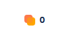
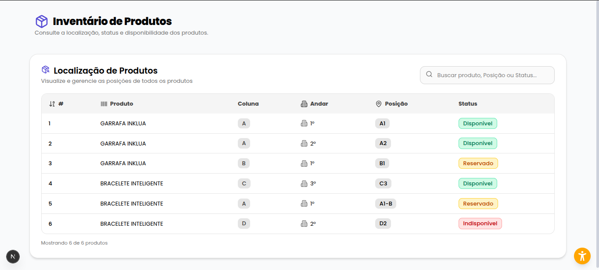

# inklua-docker

# Como Rodar o Projeto

## Requisitos

Docker (docker compose)
WSL (caso esteja usando windows, que nativamente não reconhece arquivos .sh usados para fazer build completo do projeto, popular banco de dados e etc)

Este repositório é responsável por **orquestrar todo o ambiente da aplicação** usando **Docker Compose**.  
Aqui fica apenas:

- o arquivo `docker-compose.yml`

Os serviços principais não estão aqui — eles são clonados como subpastas deste projeto.

---

## 📦 Arquitetura do Projeto

Este repositório funciona como **um orquestrador** que reúne três outros repositórios:

Clone os seguintes repositórios DENTRO de INKLUA-DOCKER

https://github.com/DarlanHildebrando/backend-system-py/ (branch mais atualizada: feat/IN-61-queue)

https://github.com/samuel-bordignon/backend-system-node/

https://github.com/samuel-bordignon/frontend-system/


para inicializar o projeto rode:

### Frontend:

```bash

cd frontend-system/

npm install

npm audit fix #caso necessário

npm run dev

```

Criar arquivo .env no frontend-system:

```env

NEXT_INTERNAL_API_BASE=http://backend-node:3001
NEXT_PUBLIC_API_BASE=http://localhost:3001

```

### Backend e banco de dados

```bash
# Dentro de inklua-docker
docker compose up --build
```
Acesse http://localhost:3000/clientes/ (home page)

faça login com um de nossos usuários testes:

```bash
email: joao@gmail.com
senha: 123456
```

## InkluaStore

Clique no ícone de InkluaCoins da Navbar para acessar loja:



após enviar seus pedidos ao carrinho e finalizar a compra, irá chegar uma notificação para o rastreio do produto. Clique no ícone de notificação ao lado de InkluaCoins para acessar.

Aviso: a notificação é disponibilizada apenas se o middleware da mesa Iot estiver no ar!

## Estoque

Para acessar o estoque, acesse: http://localhost:3000/admin/estoque



Tela bonitona! :)